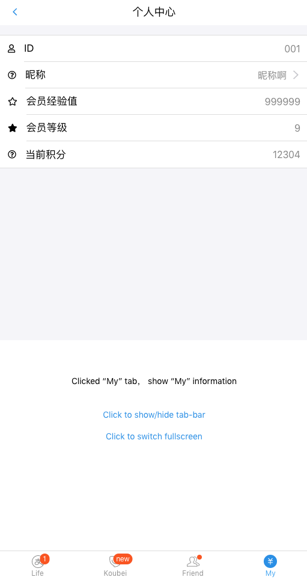

# 多顺路 React 搭建 (Typescript版本)


## 开发计划
### 1. 如果简写`setState`?


**dependences**  
```shell
> npm install -g cnpm
> cnpm install -g create-react-app

## 创建react app
> create-react-app appName --typescript
> cd appName

## 安装Ant-Design
> cnpm install antd-mobile --save
```

**按需加载** 
[按需加载官方教程](https://mobile.ant.design/docs/react/use-with-create-react-app-cn)


**首个测试**  
  

**Tabbar状态测试**  
```typescript
type Props = {
    style: React.CSSProperties
}

type State = {
    selectedTab: SelectedTab,
    hidden: boolean,
    fullScreen: boolean
}

type Message 
    = MsgUnit<"SwitchHidden">
    | MsgUnit<"SwitchFullScreen">
    | Msg<"SelectTab", SelectedTab>
    
type SelectedTab = "tab1" | "tab2" | "tab3" | "tab4"

export class MyTabBar extends BaseComponent<Props, State, Message> {
  constructor(props: Props) {
    super(props);
    this.state = {
      selectedTab: "tab1",
      hidden: false,
      fullScreen: false,
    };
  }

  eval (msg: Message) {
    switch (msg.typename) {
        case "SelectTab": {
            this.setState({selectedTab: msg.value});
            break;
        }
        case "SwitchFullScreen": {
            this.setState({fullScreen: !this.state.fullScreen});
            break;
        }
        case "SwitchHidden": {
            this.setState({hidden: !this.state.hidden});
            break;
        }
    }
  }

  render() {
      ...
  }
}
```